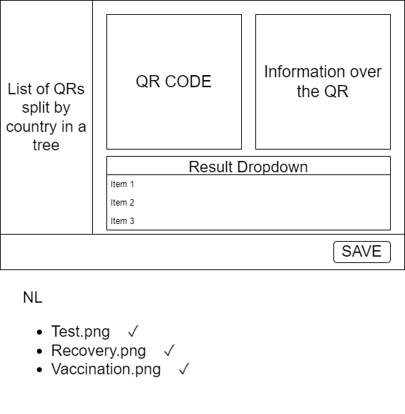

# EU DCC Validation process
The purpose of this initiative is the automation of the EU DCC validation process. 

[](https://eu-dcc-validation.web.app/)

## Introduction 
### Validation Cycle 
During the “Validation Cycle” the member states are using their Verifier App and scan the [DCCs in the Quality Assurance](https://github.com/eu-digital-green-certificates/dcc-quality-assurance) repository. 

* The scanning process will still take place manually. The suggested, in this place, tools would aim to make it easier and will automate the collections, distribution, and analysis of the results.  

### Validation Portal
The creation of a Validation Portal is suggested which will: 
* Allow easy navigation to all reference QR codes.  
* Capture the results from the countries in a comfortable way. 
* Export the results in a standard JSON format.  




#### Validation Flow 

1.	The interface pulls the QR codes from GitHub and displays them one by one.
2.	The user can navigate between the QR codes by using the Previous/Next buttons. The QR codes are also available in a list grouped by Country 
3.	The user uses the Verifier app and scans the QR Code in the display.
4.	If the Scan gives no errors the user presses the Green (Passed) button.
5.	If the Scan gives errors or warning the user fills in a copy describing the situation and pressed the amber or red button respectively.

**Automation**
1.	The user registers once the MS who uses the Verifier app for. 
2.	The application keeps track of all the submitted data and relates them with the QR Codes.
3.	The application exports the captured results in JSON. 
4.	The application would provide the option for the user to take a photo of the verifier app showing the error message. The application will store these images and will relate them to the results. 

### Result format
Test results are provided one json file per platform.
```
[{
	"file": "NL/1.3.0/REC.png",		
	"result": "Valid|Invalid|Error",
	"comment": "Free text"
},{
	"file": "NL/1.3.0/REC.png",		
	"result": "Valid|Invalid|Error",
	"comment": "Free text"	
}]
```
`file`: the relative path to the test file from the root of the QA repository. this path is returned by the github API if you use that.
`result`: the test result, `Valid` for valid, `Invalid` if the DCC was scanned but deemed invalid, `Error` if the DCC did not scan.
`comment`: optional free text explaining the result if it isn't `Valid`
The file name contains the country code, the test date and the platform:
```
YYYYDDMM-XX-PLATFORM.json
```
So for NL tests conducted on 2022-01-17 you have these two files (for both platforms):
```
20220117-NL-ANDROID.json
20220117-NL-IOS.json
```

## Planning and Roadmap
Visit the [EU DCC Validation Planning project](https://github.com/users/skounis/projects/4/views/1)

## Development instructions 
This project was generated with [Angular CLI](https://github.com/angular/angular-cli) version 13.1.3.

### Development server

Run `ng serve` for a dev server. Navigate to `http://localhost:4200/`. The app will automatically reload if you change any of the source files.

### Code scaffolding

Run `ng generate component component-name` to generate a new component. You can also use `ng generate directive|pipe|service|class|guard|interface|enum|module`.

### Build

Run `ng build` to build the project. The build artifacts will be stored in the `dist/` directory.

### Running unit tests

Run `ng test` to execute the unit tests via [Karma](https://karma-runner.github.io).

### Running end-to-end tests

Run `ng e2e` to execute the end-to-end tests via a platform of your choice. To use this command, you need to first add a package that implements end-to-end testing capabilities.

### Further help

To get more help on the Angular CLI use `ng help` or go check out the [Angular CLI Overview and Command Reference](https://angular.io/cli) page.

# Licensing
Copyright (c) 2022 Stavros Kounis (Directorate-General CONNECT), Ryan Barrett (Dutch Ministry of Health, Science, and Sports), and all other contributors

Licensed under the EUROPEAN UNION PUBLIC LICENCE v. 1.2 (the "License"); you may not use this file except in compliance with the [License](./LICENSE.txt).

You may obtain a copy of the License at https://joinup.ec.europa.eu/collection/eupl/eupl-text-eupl-12.

Unless required by applicable law or agreed to in writing, software distributed under the License is distributed on an "AS IS" BASIS, WITHOUT WARRANTIES OR CONDITIONS OF ANY KIND, either express or implied. See the LICENSE for the specific language governing permissions and limitations under the License.

